# Crack Width Calculator (Wiecon)

A desktop application that calculates the characteristic crack width **`w_k`** of a reinforced-concrete section to **EN 1992-1-1 cl. 7.3.4** and checks it against an allowable limit.

Built with [NiceGUI](https://nicegui.io/) + [pywebview](https://pywebview.flowrl.com/) as a native, portable Windows app — results are stored in a local SQLite database and can be exported to PDF.

> Illustrated end-user instructions ship with the app as `docs/CrackWidth_User_Guide.pdf`.

---

## Demo

A short walkthrough of the app in action — **click to watch on YouTube**:

[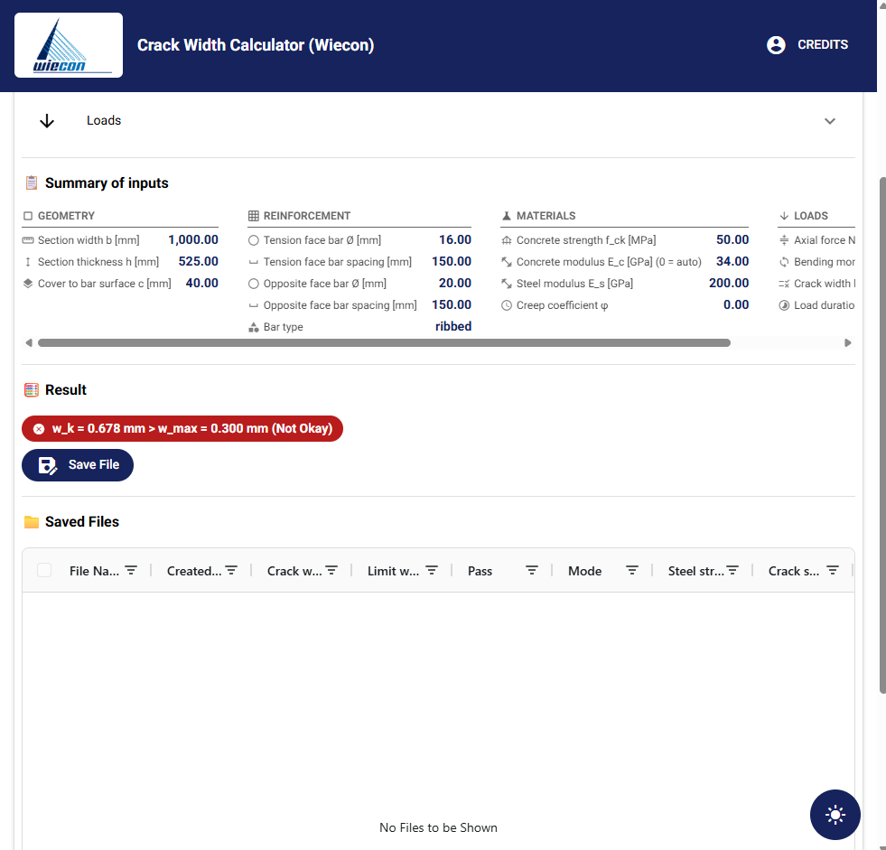](https://youtu.be/G4kASaX6ajU)

▶ Watch on YouTube: https://youtu.be/G4kASaX6ajU

---

## Features

- **Crack-width check to EN 1992-1-1 cl. 7.3.4** — computes `w_k`, steel stress `σ_s`, crack spacing `s_r,max`, effective reinforcement ratio `ρ_p,eff`, and a PASS/FAIL verdict against `w_max`.
- **Live result, no Calculate button** — the check re-runs as you type (~164 µs, so it is imperceptible) and a colour-coded badge shows the verdict as a full comparison: `w_k = 0.678 mm > w_max = 0.300 mm (Not Okay)`.
- **Guided input** — grouped panels for Geometry, Reinforcement, Materials and Loads, with a live summary of inputs.
- **Save & manage results** — name and store each check in a local database; browse, view details, and delete from an AG Grid table.
- **PDF export** — one report page per saved file (via `fpdf2`), written to the user's Downloads folder.
- **Native, portable** — runs in its own window; the database travels next to the executable, so the whole folder works from a USB stick.
- **Quality-of-life** — light/dark theme toggle, fullscreen (`f`), and a bundled illustrated user guide.

---

## Screenshots

| Input panels & live values | Saved files (colour-coded PASS / FAIL) |
|---|---|
| 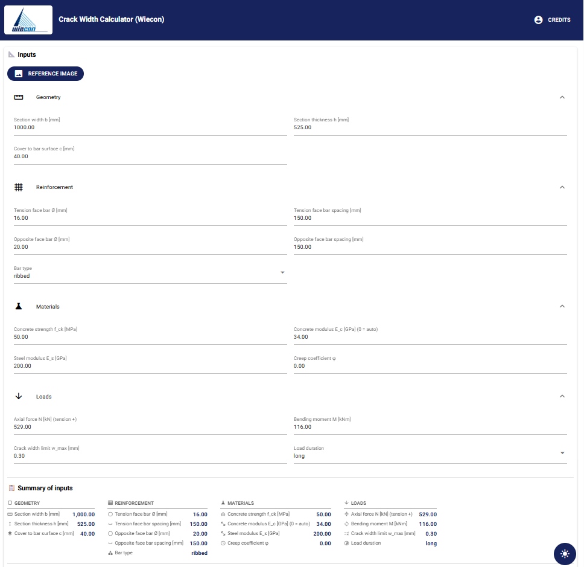 | 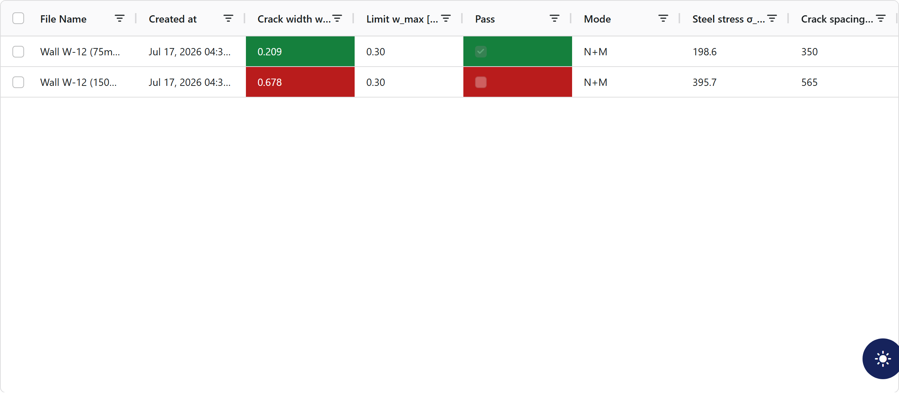 |

**Live result badge** — recalculates as you type; no Calculate button:

| Within the limit | Over the limit |
|---|---|
| 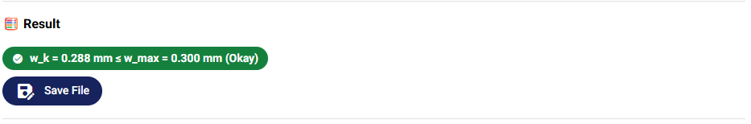 | 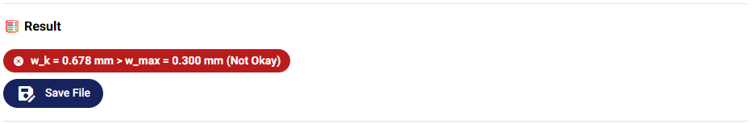 |

**Save dialog** — the verdict is repeated for confirmation before the check is named and stored:

| PASS (w_k ≤ limit) | FAIL (w_k > limit) |
|---|---|
| 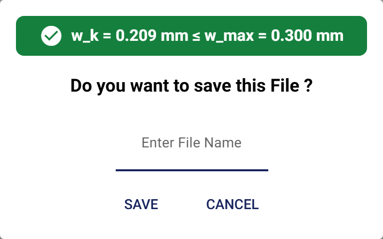 | 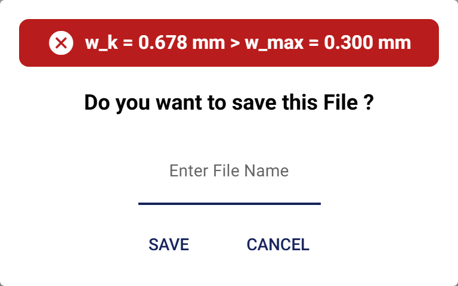 |

**Detail view & PDF export** — expandable inputs/results with a one-click PDF report:

| PASS detail | FAIL detail |
|---|---|
| 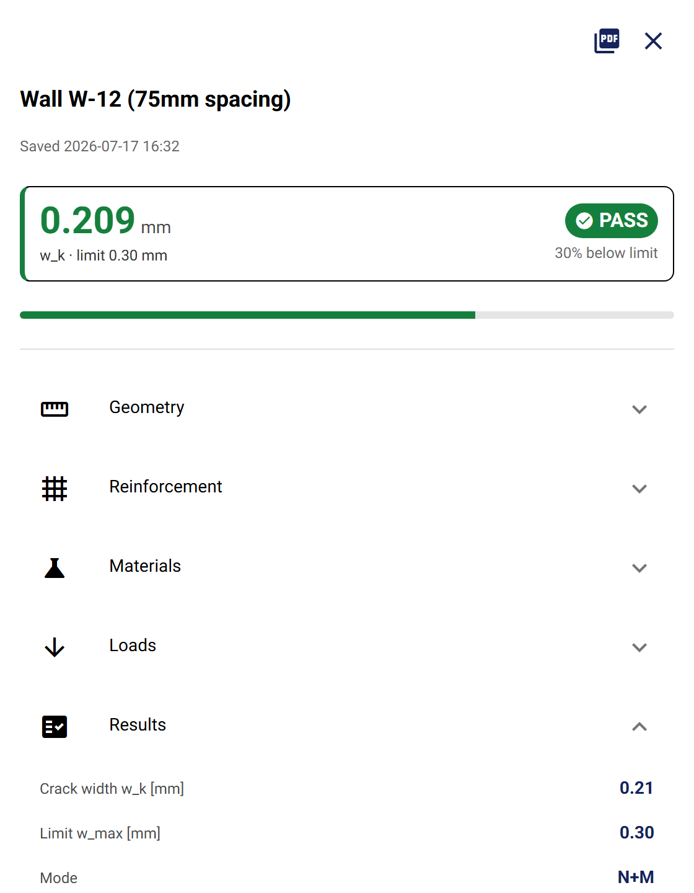 | 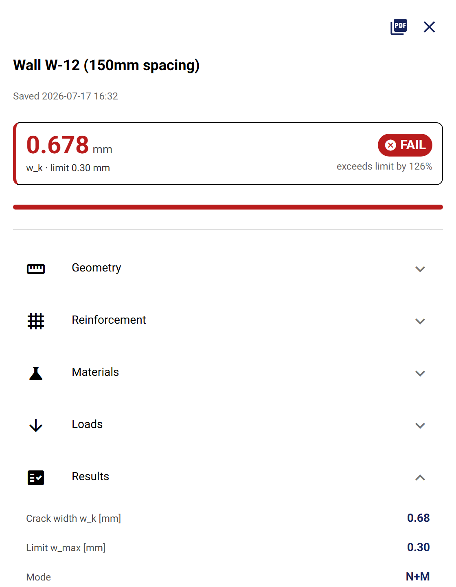 |

**Light & dark themes** — toggled with the round button, bottom-right; the icon shows the mode you are in:

| Light mode (default) | Dark mode |
|---|---|
|  | 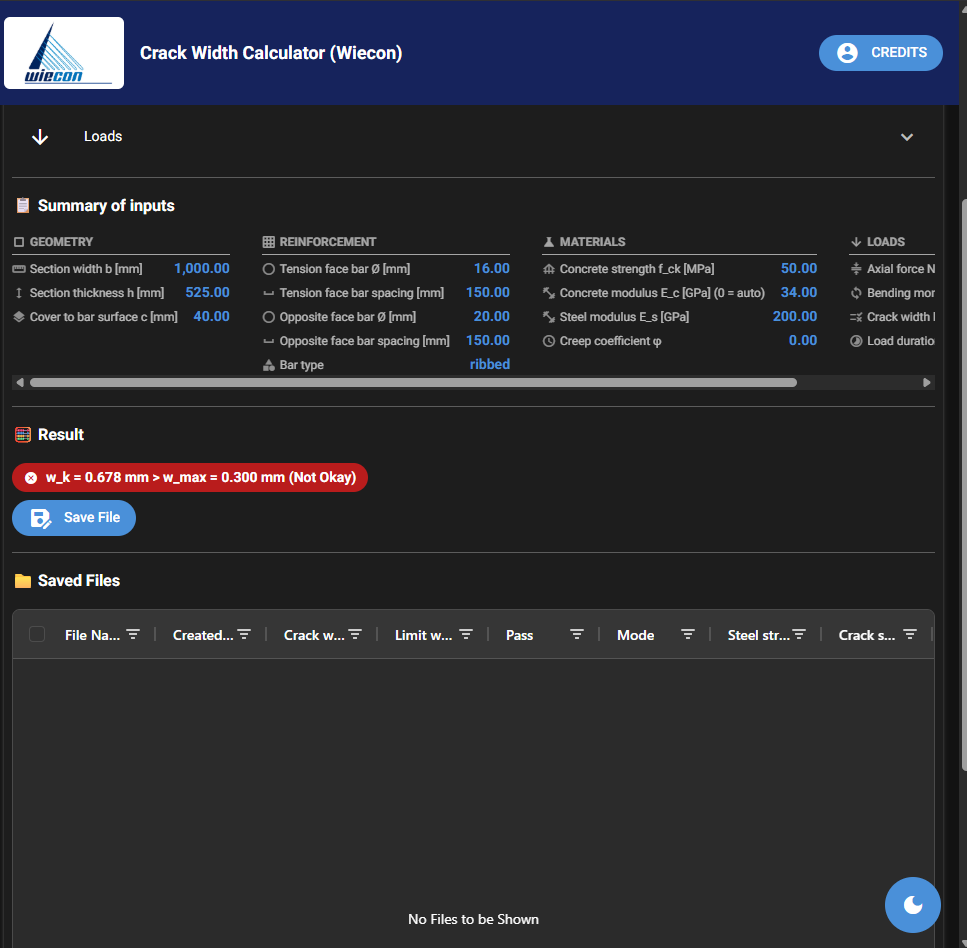 |

<sub>Fullscreen: press <kbd>f</kbd>.</sub>

**Bulk import & template** — download the CSV/Excel template, then upload multiple crack cases at once:

| Download the import template | Upload dialog |
|---|---|
|  | 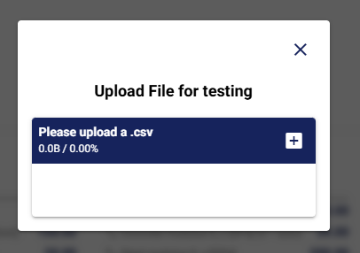 |

**Settings** — configure defaults; saved settings are reloaded on the next launch:

| Settings dialog | Settings reloaded on start |
|---|---|
| 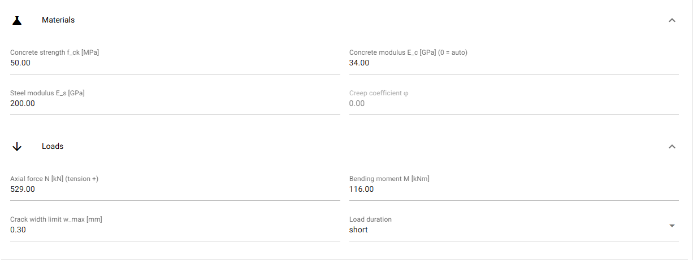 | 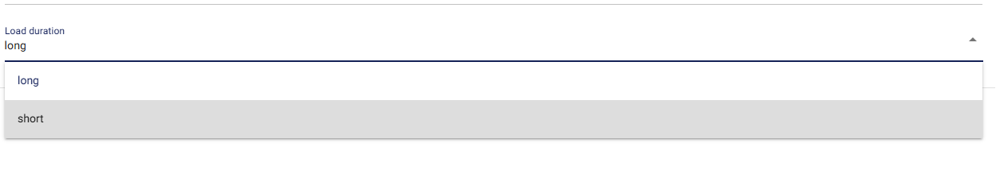 |

**Built-in help** — an illustrated help dialog is available in-app:

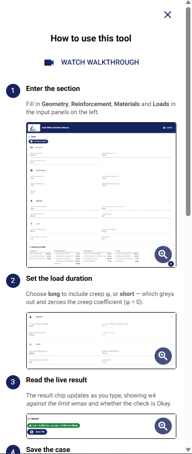

---

## Tech stack

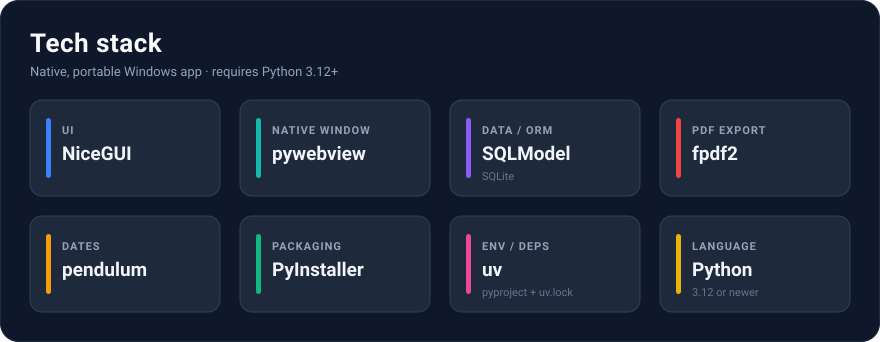

---

## Project structure

```
Crack_width_application/
├── main_niceGUI.py              # NiceGUI app: UI, live result + save flow, saved-files grid, PDF export
├── WieconTools/
│   └── crack_width_formula.py   # Calculation engine: crack_analyze(...).run() -> report_result
├── DatabaseInteractionTools/
│   └── InteractionFile.py       # CRUD wrapper over the results table
├── models/
│   └── models.py                # SQLModel table (CrackWidthResultTable) + DB engine
├── tests/
│   └── test_creep.py            # Engine regression suite (pytest): pins the benchmark
├── docs/                        # Logos, reference image, screenshots, generated user-guide PDF,
│                                #   technical briefing (architecture / verification / defects)
├── build_user_guide.py          # Generates the user-guide PDF from docs/screenshots (fpdf2)
├── CrackWidthNiceGUI.spec       # PyInstaller build spec (windowed, icon, bundles docs/)
├── CHANGELOG.md                 # Release history (shipped beside the .exe)
├── README.md                    # This file — project overview
├── pyproject.toml / uv.lock     # Dependencies (managed with uv)
└── database/                    # Local SQLite DB in dev (next to the .exe when packaged)
```

---

## Getting started (development)

This project uses [uv](https://docs.astral.sh/uv/).

```bash
# 1. Install dependencies into a virtual environment
uv sync

# 2. Run the app in dev mode (opens a browser tab at http://localhost:8082, with live reload)
uv run python main_niceGUI.py

# 3. Run the engine's regression suite
uv run pytest
```

In development the app runs in the browser with auto-reload; when packaged it runs `native=True` in its own window with reload disabled.

---

## Building the Windows executable

Packaging is done with PyInstaller using the provided spec (windowed, custom icon, `docs/` bundled):

```bash
uv run pyinstaller CrackWidthNiceGUI.spec --distpath dist/
```

- Output: `dist/CrackWidthNiceGUI/CrackWidthNiceGUI.exe` (one-dir build — keep the whole folder together).
- The exe launches windowed (no console) and uses `docs/Wiecon_logo.ico` as its icon.
- If you change the icon file but not its path, add `--clean` so PyInstaller regenerates the cached icon resource.

### Regenerating the user guide

```bash
uv run python build_user_guide.py   # writes docs/CrackWidth_User_Guide.pdf
```

The PDF lives in `docs/`, so it is automatically bundled into the next build.

---

## How it works

The engine in `WieconTools/crack_width_formula.py` is UI-independent:

```python
from WieconTools.crack_width_formula import crack_analyze

result = crack_analyze(
    section_width=1000, section_thickness=525, cover_to_bar_surface=40,
    tension_face_bar_diameter=16, tension_face_bar_spacing=150,
    opposite_face_bar_diameter=20, opposite_face_bar_spacing=150,
    concrete_strength=50, concrete_modulus=34, steel_modulus=200,
    creep_coeff=0.0, bar_type="ribbed", load_duration="long",
).run(N_kN=529, M_kNm=116, w_max=0.30)

print(result.wk, result.ok, result.mode)   # crack width, pass/fail, N+M vs pure-tension
```

`run()` returns a `report_result` dataclass with every intermediate quantity of the cl. 7.3.4 check.

In the UI, `collect_inputs_and_run_calculation(values)` is the single shared core: it splits one input dict into the constructor arguments and the three load arguments (`N_kN`, `M_kNm`, `w_max`), then runs the check. It holds no UI and catches nothing — it raises, and each caller picks its own policy. The live badge swallows failures into a grey `—` (a half-typed value is an ordinary state, not an error), while the save path reports them in a notification. Nothing is cached: the result is always derived from the inputs at the moment it is used, so a stored row's inputs and outputs can never disagree.

Saving persists inputs + selected outputs via `DatabaseInteractionTools/InteractionFile.py`.

### Data storage

Results are stored in a SQLite database (`WieconDatabaseResult.db`) defined by `CrackWidthResultTable` in `models/models.py`. To stay portable, a packaged build keeps the database in a `data/` folder **next to the executable** (not in the temp unpack dir), so saved files persist and travel with the app.

---

## Changelog

Full release history is in [`CHANGELOG.md`](CHANGELOG.md).

<details>
<summary><strong>Latest — v2.1.7 (2026-07-21)</strong></summary>

- **Bulk import from a `.csv` file** — the Import and Download button calculates and
  saves every row as a case, with a progress bar and a confirmation of how many cases
  were added.
- **Downloadable blank template** — a template `.csv` showing the exact columns an
  import expects; fill one row per case and upload it back.
- **Help & user guide** updated with the new import workflow (with screenshots).

_Results are unaffected — imported cases run through the same EN 1992-1-1 engine as
hand-entered cases._

</details>

---

## License

Proprietary — © Wiecon. All rights reserved. _(Update this section with your intended license.)_
